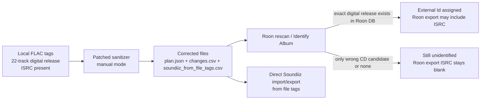

# Roon Identification Failure for Paper Cuts #1

## Executive summary

The failure to identify **Paper Cuts #1** is now best understood as a **Roon metadata-coverage / release-version mismatch**, not primarily a bad-tag problem. Roon’s own docs say identification can fail when your copy does not match any version in its database, or when structure and timing do not line up; its manual Identify Album flow also requires your local track order to match the version in Roon’s database. citeturn14view0turn3view0

Repository-facing evidence available in-session shows the sanitizer was designed as a **dry-run-first, provider-backed FLAC metadata normalizer** that scores coherent release candidates, prefers ISRC-first track mapping, and can also operate in a provider-free manual mode. The implementation plan ties it directly into the `tagslut` provider stack and adds Spotify album-track fetching alongside Qobuz, TIDAL, and Beatport release discovery. fileciteturn0file3L5-L9 fileciteturn0file3L38-L45 fileciteturn0file3L53-L80

### Concise diagnosis

`Paper Cuts #1` is locally coherent as a **1-disc, 22-track digital release** with embedded ISRCs, but Roon is still presenting a materially different **2×CD-style candidate** and leaving the album without an external identity in the exported album view. Roon’s docs distinguish local file-backed album identity from the global identity used to blend Roon cloud metadata with your files; in practice here, the album remains local/unidentified, so the embedded ISRCs do not make it through to the Roon/Soundiiz export layer. citeturn4view0turn14view0turn3view0

### Minimal actionable recommendations

1. **Keep the corrected local digital-release tags and do not save the wrong 2×CD Roon candidate.** Roon explicitly warns that not every version has the same track order, and a mismatched Identify Album save will attach the wrong release metadata. citeturn3view0  
2. **Run the patched sanitizer in `--provider manual` mode for this album and use its direct `soundiiz_from_file_tags.csv` instead of Roon’s empty-ISRC export.** Manual mode is explicitly designed to preserve the local release structure and not pretend to create a Roon external identity. fileciteturn0file4L1157-L1167 fileciteturn0file4L1221-L1227 fileciteturn0file4L1399-L1472  
3. **Force a Roon rescan and retry Identify Album once after the corrected tags are written.** If Roon still only offers the wrong CD-version candidate, stop there and treat the problem as a database-coverage gap rather than continuing to polish tags. citeturn13view0turn14view0  
4. **Use Roon “Prefer File” for display control, not as an identification fix.** Roon says “Prefer File” changes display preference and merging behavior, but it does not mean “File Tags Only” and does not promise identification from local tags alone. citeturn2view1  
5. **Check MusicBrainz for the exact 22-track digital release; add it if missing, then re-test with MBIDs/Picard and a new Roon rescan.** MusicBrainz release modeling is the most plausible external route for making this digital release legible to Roon’s metadata ecosystem. citeturn5view1turn5view2

### Exact workflow and commands

The exact local patched filename is **unspecified** if you did not save it as `roon_metadata_sanitize_fixed_v2.py`; substitute your local patched copy as needed.

```bash
SCRIPT="roon_metadata_sanitize_fixed_v2.py"   # or your local patched copy
ALBUM_DIR="/Volumes/REKORDBOX/USBSMB/share/[2012] Paper Cuts #1"
REPORT_DIR="$HOME/roon-paper-cuts-1-review"

python3 "$SCRIPT" \
  --provider manual \
  "$ALBUM_DIR" \
  --album "Paper Cuts #1" \
  --album-artist "Various Artists" \
  --date "2012-06-11" \
  --label "Paper Recordings" \
  --catalog-number "PAPDLA028" \
  --barcode "5052653698290" \
  --total-tracks 22 \
  --total-discs 1 \
  --compilation yes \
  --report-dir "$REPORT_DIR" \
  --verbose
```

Review the outputs, then run the same command with `--execute` added:

```bash
python3 "$SCRIPT" \
  --provider manual \
  "$ALBUM_DIR" \
  --album "Paper Cuts #1" \
  --album-artist "Various Artists" \
  --date "2012-06-11" \
  --label "Paper Recordings" \
  --catalog-number "PAPDLA028" \
  --barcode "5052653698290" \
  --total-tracks 22 \
  --total-discs 1 \
  --compilation yes \
  --report-dir "$REPORT_DIR" \
  --verbose \
  --execute
```

Verify the critical outputs and tags:

```bash
grep -n '"local_isrc_count"\|"direct_soundiiz_csv"\|"structure_notes"' "$REPORT_DIR/plan.json"
head -5 "$REPORT_DIR/soundiiz_from_file_tags.csv"

metaflac \
  --show-tag=ALBUMARTIST \
  --show-tag=DATE \
  --show-tag=LABEL \
  --show-tag=CATALOGNUMBER \
  --show-tag=BARCODE \
  --show-tag=ISRC \
  "$ALBUM_DIR/1-01. Hey Lets Do It! - Proviant Audio.flac"
```

Run a safe decode test across the release:

```bash
bad=0
while IFS= read -r -d '' f; do
  flac -t "$f" || bad=1
done < <(find "$ALBUM_DIR" -name '*.flac' -print0)
test "$bad" -eq 0
```

Then in Roon:

- **Settings → Storage → Force Rescan**
- open the album
- **Edit → Identify Album**
- if the only meaningful candidate is still the wrong CD version, **do not save it**

Roon documents rescanning for changed file tags, manual Identify Album, and track-order alignment directly. citeturn13view0turn3view0

The exact **tagslut export CLI** was **not specified** in the available repo artifacts. For this album, the reliable export artifact is the sanitizer’s own `soundiiz_from_file_tags.csv`; if you already have a tagslut CSV export step in your environment, compare it against that file rather than against Roon’s blank-ISRC export. The patched script explicitly writes and prints that direct Soundiiz CSV path. fileciteturn0file4L1399-L1472 fileciteturn0file4L2030-L2032

### Script role and outputs

The local sanitizer’s role is to **normalize local FLAC truth**, not to manufacture a Roon `External Id`. In manual mode it preserves the existing local release structure, writes canonical Roon-facing tags, and explicitly notes that it “does not create a Roon external identity.” fileciteturn0file4L1157-L1167 fileciteturn0file4L1221-L1227

Its three key outputs are:

- `plan.json`: selected mode/provider, candidate scores, provider errors, structure notes, per-file before/after tags, and `local_tag_audit` including local ISRC counts and the direct Soundiiz CSV path. fileciteturn0file4L1428-L1472  
- `changes.csv`: the per-file, per-tag diff to review before or after execution. fileciteturn0file4L1448-L1475  
- `soundiiz_from_file_tags.csv`: a direct `title;artist;album;isrc` export from local/planned tags, specifically meant to bypass Roon when an album stays unidentified and Roon’s export layer blanks ISRCs. fileciteturn0file4L1399-L1425

The same patched script also keeps provider-backed discovery available through Qobuz, TIDAL, Spotify, and Beatport, and its repo plan specifies ISRC-first matching with title/artist+duration fallback plus ambiguity refusal. That is useful in general, but for **Paper Cuts #1** the relevant mode is manual because the database-side release identity is the current blocker. fileciteturn0file4L1550-L1562 fileciteturn0file3L38-L45

### MusicBrainz note

MusicBrainz defines a **release** as a unique issue of a product identified by properties such as date, label, barcode, and catalog number, and it explicitly says that **digital releases should generally follow the structure set by the artist or label**. That maps well to this problem: if the exact **22-track digital** `Paper Cuts #1` release exists in MusicBrainz, test adding MusicBrainz release and recording IDs to the files with Picard or your own tooling and then rescan Roon; if it does **not** exist, add it as an **official Digital Media release** with the actual digital structure, the 2012-06-11 date, label `Paper Recordings`, catalog `PAPDLA028`, barcode `5052653698290`, and per-track ISRCs from your files. I could not verify the existence of that exact release from MusicBrainz web search results in this session, so its current MusicBrainz existence should be treated as **unknown** until checked directly in MusicBrainz/Picard. citeturn5view1turn5view2

## Evidence and layer comparison

Roon’s official model is useful here: albums and tracks are always local file-backed objects first, and they may additionally share a broader global identity that lets Roon blend in cloud metadata. That distinction is exactly why a file-correct album can still remain **unidentified** in Roon. citeturn4view0

The layer comparison below combines the supplied local tags and exports with that Roon model.

| Layer | Observed state for `Paper Cuts #1` | Interpretation |
|---|---|---|
| Local FLAC tags | `ALBUM=Paper Cuts #1`, `ALBUMARTIST=Various Artists`, `DATE=2012-06-11`, `LABEL=Paper Recordings`, `CATALOGNUMBER=PAPDLA028`, `BARCODE=5052653698290`, `TOTALDISCS=1`, `TOTALTRACKS=22`, `COMPILATION=1`, per-track `ISRC` present | The local files are coherent as the 22-track digital release |
| Roon album export | `Track Count=22`, `Media Count=1`, `Date=20120611`, `External Id` blank | Roon sees the local digital structure but has not attached external/global identity |
| Roon/Soundiiz export | 22 rows for `Paper Cuts #1`, all `isrc` values blank | Roon is not surfacing local embedded ISRCs for this unidentified album |
| Identified sibling albums in user export | `External Id` populated (`mb:` / `rovi:`) and ISRCs usually present in exports | Export-layer ISRC availability appears to correlate with identification status |



Two Roon documentation points matter most here. First, Roon says it uses your tags, timings, UPCs, year, and related data to match your music to its metadata database; second, it says that if your version does not match a version in its database, identification may fail, and Identify Album requires you to align your local tracks to the order in Roon’s database. That combination strongly supports the diagnosis that the remaining problem is **version mismatch / database coverage**, not malformed local tags. citeturn2view0turn14view0turn3view0

## Why identification still fails

Roon’s file-tag documentation emphasizes album title, track title, artist names, UPCs/product codes, year, and carefully structured metadata as inputs for matching, but it does **not** document embedded local per-track ISRC as a guaranteed identification key in the user-facing workflow. In the technical metadata model, album-level product codes are documented, but track-level schema does not expose a dedicated ISRC field in the same way it exposes title, track number, media number, duration, and format. That does not prove Roon can never use ISRC internally, but it does mean the official documentation does not promise identification from local ISRCs alone. citeturn2view0turn4view0

That matters because your empirical evidence cuts against the stronger claim that “Roon reads the file ISRC and therefore identification should work.” The album is locally clean, Roon sees the right local structure, yet `External Id` remains blank and the Roon/Soundiiz export still strips ISRCs. By contrast, other identified Paper Cuts volumes in your export set carry external IDs and mostly preserve ISRCs in export. The simplest rigorous reading is: **for this album, embedded local ISRCs are not sufficient to push the album from local-only state into Roon’s identified/global state**.

Roon’s database behavior also explains the confusing candidate list. The Identify Album help page says that once you choose a match, the album’s information comes from **Roon’s database**, and it explicitly warns that different versions of the same album can have different track orders. The supplied screenshot and local observations fit a case where Roon is surfacing a **different release manifestation** of `Paper Cuts #1` than the one you actually own. citeturn3view0turn14view0

Finally, Roon’s own metadata documentation explains why this distinction matters so much: the local album always has its own file-backed identity, but the richer credits/reviews/original-release context come from the global metadata identity that Roon can associate with it. If the exact 22-track digital release is missing or not chosen, the local album remains stranded on the local side of that boundary. citeturn4view0

## Role of the local sanitizer script

The sanitizer is best thought of as a **local-truth, pre-Roon normalization and export tool**. The implementation plan says its goal is to emit Roon-compatible metadata only after one coherent provider edition is selected, while remaining dry-run-first and safe; it also adds only the missing public Spotify album-track method to the existing provider layer instead of turning the tool into a metadata source of its own. fileciteturn0file3L5-L9 fileciteturn0file3L61-L80

That design matters for `Paper Cuts #1`. In normal provider-backed operation, the tool can search across provider clients, resolve a coherent release, and score candidates. In manual mode, it bypasses that lookup entirely and uses the local tags plus explicit overrides to create a stable plan that preserves the digital structure. The patched local script now describes itself as normalizing FLAC metadata for **Roon display, audit, and identification attempts** rather than promising to “fix Roon identification,” which is the correct framing for this album. fileciteturn0file4L1732-L1776 fileciteturn0file4L1900-L1903

The script also includes an important integrity guard for your library: it verifies managed tags after writes and only enforces FLAC audio-MD5 comparison when a STREAMINFO MD5 is actually present, which avoids false failures on valid older FLACs that decode correctly but were encoded without embedded STREAMINFO MD5. fileciteturn0file4L1360-L1387

For this specific case, the script is therefore **necessary but not sufficient**. It can:

- normalize the release to the correct digital metadata,
- preserve `1 disc / 22 tracks`,
- standardize `ALBUMARTIST`, date, label, catalog, barcode, and compilation fields,
- verify writes safely,
- and produce a direct ISRC-bearing Soundiiz CSV.

What it cannot do is create the missing Roon-side release identity by itself. That missing identification step still depends on Roon’s database coverage and/or MusicBrainz alignment.

## Exact workflow and commands

The following is the minimal workflow that matches the evidence and avoids the wrong release.

Use **manual mode** and write the corrected digital-release identity:

```bash
SCRIPT="roon_metadata_sanitize_fixed_v2.py"   # if your patched filename differs, substitute it
ALBUM_DIR="/Volumes/REKORDBOX/USBSMB/share/[2012] Paper Cuts #1"
REPORT_DIR="$HOME/roon-paper-cuts-1-review"

python3 "$SCRIPT" \
  --provider manual \
  "$ALBUM_DIR" \
  --album "Paper Cuts #1" \
  --album-artist "Various Artists" \
  --date "2012-06-11" \
  --label "Paper Recordings" \
  --catalog-number "PAPDLA028" \
  --barcode "5052653698290" \
  --total-tracks 22 \
  --total-discs 1 \
  --compilation yes \
  --report-dir "$REPORT_DIR" \
  --verbose
```

What to check after the dry run:

```bash
grep -n '"selected_release"\|"structure_notes"\|"local_tag_audit"\|"direct_soundiiz_csv"' \
  "$REPORT_DIR/plan.json"

head -5 "$REPORT_DIR/changes.csv"
head -5 "$REPORT_DIR/soundiiz_from_file_tags.csv"
```

If the plan looks correct, execute it:

```bash
python3 "$SCRIPT" \
  --provider manual \
  "$ALBUM_DIR" \
  --album "Paper Cuts #1" \
  --album-artist "Various Artists" \
  --date "2012-06-11" \
  --label "Paper Recordings" \
  --catalog-number "PAPDLA028" \
  --barcode "5052653698290" \
  --total-tracks 22 \
  --total-discs 1 \
  --compilation yes \
  --report-dir "$REPORT_DIR" \
  --verbose \
  --execute
```

Verify one representative file:

```bash
metaflac \
  --show-tag=ALBUM \
  --show-tag=ALBUMARTIST \
  --show-tag=DATE \
  --show-tag=LABEL \
  --show-tag=CATALOGNUMBER \
  --show-tag=BARCODE \
  --show-tag=ISRC \
  "$ALBUM_DIR/1-01. Hey Lets Do It! - Proviant Audio.flac"
```

Verify all FLACs decode cleanly:

```bash
bad=0
while IFS= read -r -d '' f; do
  echo "Testing: $f"
  flac -t "$f" || bad=1
done < <(find "$ALBUM_DIR" -name '*.flac' -print0)
test "$bad" -eq 0
```

Then do the minimum Roon-side operations that its own docs support:

- **Settings → Storage → Force Rescan**
- open the album
- **Edit → Identify Album**
- inspect the candidate list
- if the only plausible match is still the wrong CD-version release, **do not save it**

Roon documents all four pieces of that path: file-tag rescans, Identify Album, track-order checking, and View File Info → File Tags for spot inspection. citeturn13view0turn3view0turn13view1

## MusicBrainz path

MusicBrainz is the best structured external route if you want to convert this from a “clean local but unidentified” album into something Roon is more likely to recognize correctly. MusicBrainz’s release model says a release is distinguished by date, label, barcode, catalog number, and medium structure, and specifically notes that **for digital releases the mediums should generally follow the structure set by the artist or label**. So the right MusicBrainz target is **not** a CD surrogate—it is the actual digital release you have: `Paper Cuts #1`, `Various Artists`, `Paper Recordings`, `2012-06-11`, `PAPDLA028`, `5052653698290`, `Digital Media`, `1 medium`, `22 tracks`, with the tracklist and ISRCs taken from the files. If that exact release already exists, test MBIDs/Picard and rescan Roon. If it does not, add it as a separate official digital release rather than trying to bend the files toward the CD edition. citeturn5view1turn5view2

## Prioritized sources

The most useful sources for this diagnosis and workflow were these:

- Roon **File Tag Best Practice** — what Roon says it uses from file tags and when it re-reads them. citeturn2view0  
- Roon **Import Settings** — what “Prefer File” does and does not do globally. citeturn2view1  
- Roon **Identify Albums** — why version/track-order mismatches matter so much. citeturn3view0  
- Roon **Metadata Model** — the distinction between local identity and the global metadata identity Roon blends in. citeturn4view0  
- Roon **Why didn’t Roon find metadata for my album?** — official explanation of version mismatch and Identify Album fallback. citeturn14view0  
- MusicBrainz **Release** and **Style / Release** — how to model the exact digital release if MusicBrainz coverage is missing or wrong. citeturn5view1turn5view2  
- Uploaded **sanitizer implementation plan** — repo-derived description of ISRC-first matching, provider discovery, and safety model. fileciteturn0file3L5-L9 fileciteturn0file3L38-L45 fileciteturn0file3L53-L80  
- Uploaded **patched local sanitizer** — manual mode behavior, report outputs, direct Soundiiz export, and integrity checks. fileciteturn0file4L1157-L1167 fileciteturn0file4L1399-L1472 fileciteturn0file4L1360-L1387