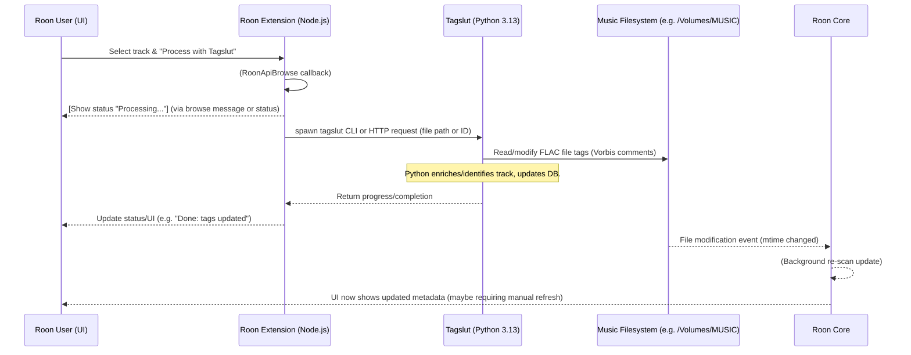

# Executive Summary

Building a Roon Extension that invokes a local Python CLI (“Tagslut”) is **feasible**, but requires careful design. The Node.js extension must use Roon’s `node-roon-api` to present a user interface (via the **Browse** service) and to monitor playback/events (via **Transport** and other services). The extension can then invoke the Python CLI (either by spawning it or via an HTTP/SSE “sidecar”) and report progress back to Roon (e.g. via status messages or browse-result “message” pop-ups). Roon stores music metadata in an internal LevelDB and does not expose absolute file paths; instead, local files appear under Roon’s `RoonMounts/RoonStorage_…` path (e.g. `/Users/you/Library/RoonMounts/RoonStorage_xxx/…`).  Reading Roon’s LevelDB directly from a separate process is *not* officially supported (LevelDB only allows one process to open the DB at once), so we must use Roon API identifiers or metadata to map tracks to our Tagslut DB. Roon’s API gives “ephemeral” track/album IDs and some metadata (title, artist, album, track length), but does **not** provide stable IDs, BPM, play count, or internal analysis data.  Workarounds include matching on artist/title/album and possibly using embedded tags or acoustical fingerprints on our side. 

For user experience, **context menus on tracks are not supported** by Roon’s API. The typical flow is to use the **Extensions** panel: the user opens **Settings → Extensions → Tagslut**, browses their library or selects the now-playing track, and clicks a “Process” action. Alternatively, an extension could offer a “Process Now Playing” button or accept external triggers (e.g. a Stream Deck hotkey calling a local webhook on the extension).  After Tagslut updates the FLAC’s Vorbis tags, Roon’s file-watcher *should* notice the change (Roon updates files in-place, preserving play counts). If not immediate, there is no Roon API call to force-rescan; the user may need to manually refresh the library or wait for Roon to re-index. 

For IPC between Node and Python, the simplest approach is `child_process.spawn`. This incurs a new process for each job, but requires no extra service. A more robust approach is to run a **FastAPI** (or Flask) sidecar in Python: Node calls `http://localhost:1234/process?file=…` (via e.g. `fetch` or `axios`), and the Python server can send asynchronous progress via Server-Sent Events (SSE) or websockets back to the Node extension. We weigh these in a comparison table below.  

For deployment on macOS, one can simply run the Node extension with `pm2`, `launchd`, or the Roon Extension Manager (e.g. via [TheAppgineer’s manager](https://github.com/TheAppgineer/roon-extension-manager/wiki) and adding our extension to its repository). The Extension Manager simplifies auto-updates but requires packaging the extension according to its JSON schema. Otherwise, a simple Node script in `~/.roon-extension` started at login is sufficient. 

**Prior Art:** Existing Roon extensions illustrate these patterns. For example, [Roon Web Controller](https://github.com/pluggemi/roon-web-controller) is a Node extension that serves a local web UI (via Roon’s Browse API).  The [roon-extension-manager](https://github.com/TheAppgineer/roon-extension-manager) project shows how to bundle and auto-deploy extensions. Command-line tools like [RoonCommandLine](https://github.com/doctorfree/RoonCommandLine) illustrate external control via Roon’s network API. The Roon community’s web forums and GitHub repos (e.g. RooExtend, Roon Art Scraper, CD ripper projects, Home Assistant Roon integration) provide useful examples of zone subscriptions, browse flows, and event subscriptions.

**Sources:** Official Roon API docs and examples; Roon Labs community forums; StackOverflow on LevelDB; and example extension repos (cited above).

---

## Architecture & IPC Options

We recommend a **Node.js extension** (using [node-roon-api](https://github.com/RoonLabs/node-roon-api)) that acts as a bridge to the Python Tagslut CLI. Key components:
- **Node Extension (Roon API)**:  Handles UI (via `RoonApiBrowse`), status (via `RoonApiStatus`), zone/playback events (via `RoonApiTransport`), and invoking Python.
- **Python Side (Tagslut)**: The existing Tagslut CLI, which may remain a pure command-line tool, or be extended with a lightweight HTTP API (e.g. using FastAPI) to accept commands.
- **IPC Mechanism**: Node ↔ Python via either direct process invocation (`child_process.spawn`) or a local HTTP/SSE server (FastAPI) or Unix socket.  
- **Filesystem**: Tagslut modifies the FLAC file in-place; Roon’s watcher should pick up the change. The Node extension can display progress and status to the user via Roon (status messages, browse messages).

The sequence of a typical action is:



**Node-to-Python IPC Options:**  

| Option                              | Complexity      | Reliability | Progress Feedback | Security    | Suits Long Jobs?          |
|-------------------------------------|-----------------|-------------|-------------------|-------------|---------------------------|
| **Child Process (`spawn`)**         | Low             | High        | Node captures stdout/stderr (prints in logs); UI updates via status/messages.  | Local only; minimal risk. | Single tasks only; each spawn independent.|
| **HTTP Sidecar (e.g. FastAPI)**     | Medium          | High        | Can return async results; can implement SSE/WebSocket for live progress if needed.  | Needs open port (localhost only recommended). | Better for concurrent or long-lived tasks; single Python process handles multiple requests. |
| **IPC Socket (Unix domain socket)** | Medium/High     | High        | Can push bidirectional messages (e.g. JSON). | Very secure (file permission). | Good for streaming output; more complex to implement. |

- *Child Process (`spawn`)* is easiest to implement. Example in Node:
  
  ```js
  const { spawn } = require('child_process');
  function runTagslut(filePath) {
    let py = spawn('tagslut', ['process', filePath]);
    py.stdout.on('data', data => {
      console.log(`Tagslut: ${data}`); 
      // Optionally send progress to Roon UI
    });
    py.stderr.on('data', data => {
      console.error(`Tagslut error: ${data}`);
    });
    py.on('close', code => {
      console.log(`Tagslut exited with code ${code}`);
      // Update Roon UI with completion
    });
  }
  ```
  
- *FastAPI Sidecar*: Launch a Python process like:
  
  ```python
  from fastapi import FastAPI, BackgroundTasks
  from pydantic import BaseModel
  import subprocess
  
  app = FastAPI()
  class ProcessRequest(BaseModel):
      file_path: str

  @app.post("/process")
  async def process_file(req: ProcessRequest, bg: BackgroundTasks):
      def run_tagslut(path):
          subprocess.run(["tagslut", "process", path])
      bg.add_task(run_tagslut, req.file_path)
      return {"status": "started"}
  ```
  Node can POST to `http://localhost:8000/process` to start the job. For real-time feedback, one could add an `/status` endpoint or use `ServerSentEvents`.

Whichever IPC, the Node extension can update the Roon UI via **RoonApiStatus** (for a persistent status line in Settings) or send a “message” via `RoonApiBrowse` to show a pop-up. 

## UI Integration & User Flow

**Roon API UI Limits:** The Roon API does *not* allow adding items to the native right-click context menu of tracks/albums in the library or player view. There is no “Process with Tagslut” menu injected into Roon’s main UI. Instead, the extension must provide its own UI via the **Browse** service. Typically this means the user goes to **Settings → Extensions → Tagslut** (after the extension is enabled in Roon). The extension’s browse interface can then let the user pick a track (or display the currently playing track) and perform actions.

**Recommended Flow:** For the smoothest UX, we suggest one of:
- **“Process Now Playing”**: If a track is playing, the extension UI can show a “Process Now Playing” button. The user simply goes to Settings→Extensions→Tagslut and clicks it, which reads the current track’s ID from `RoonApiTransport` and runs Tagslut on it.
- **Browse Library:** The extension can present a hierarchical browser (`hierarchy: "albums"` or a search interface) to let the user locate a track. For example: Albums → select album → select track → [Process with Tagslut]. This is fully handled in the extension’s browse callbacks.
- **External Trigger:** As a hack, one could listen for specific events (e.g. a particular “favorite” tag added by the user or a special Zone command) and auto-run Tagslut. Alternatively, a global hotkey on macOS could call a custom URL that the extension exposes via HTTP, but this is non-standard. 

**Exact Steps (Browse Example):**  

1. In Roon, go to **Settings** → **Extensions**. Under “Tagslut” click **Enable**.  
2. Open **Settings → Extensions → Tagslut**. This opens the extension’s custom UI.  
3. If a track is playing and a “Process Now Playing” button is shown, click it. *OR* click “Browse Albums” → navigate to the desired album → track → “Process” action.  
4. The extension will show a status (“Processing…”) and invoke Tagslut.  
5. When done, the UI updates (“Done: metadata updated”). Roon should auto-refresh the track’s metadata (if not, use “Clean Up Library” or restart Roon).  

*(Note: There is no “Share” or “Copy” workaround needed. The user triggers it via the extension UI. Roon does not fire a webhook on right-click or on copy-track-link that extensions can catch.)*

## File Path Resolution & LevelDB

Roon’s API **does not** expose the absolute file path of tracks. Instead, local storage appears under Roon’s internal mount points. On macOS, Roon creates symlink mounts at `~/Library/RoonMounts/RoonStorage_<id>/...` to the actual volume (e.g. `/Volumes/MUSIC`). For example, a track’s path might look like `/roon/sys/storage/smbmounts/RoonStorage_<UUID>/MASTER_LIBRARY/Album/Track.flac` in Roon’s view. 

Inside Roon’s LevelDB database (in `~/Library/Roon/Database/Core/<core-id>/`), each track entry stores its file location under those RoonMount paths. **Opening the LevelDB while Roon is running is risky**: LevelDB is single-writer only. Attempting to open it from Python/Node will usually fail on the LOCK file. While one could theoretically use LevelDB snapshots or hacking (symlinking the DB and removing the lock), this is fragile and unsupported. 

**Mapping Strategy:** Since direct path isn’t available, the extension should map Roon track metadata to the local path in Tagslut’s DB. Possible approaches:
- Retrieve as much metadata as Roon provides (artist, album, title, duration). Match these to our SQLite DB entries. If multiple matches, use file size or track number to disambiguate.
- Use “file fingerprint” (if Tagslut or the Roon API provided it). Roon does fingerprint files internally for duplicate detection, but this is not exposed. (We may ignore AcoustID/BPM/etc., as Roon’s API doesn’t return those.)
- Alternatively, the extension could occasionally build its own map by scanning watched folders (since it knows the Roon mounts). If Roon’s storage ID and watched folder name can be discovered, one could combine those with the path seen in Roon’s browse results (RoonApiBrowse can yield `item. track.file_key` or similar) to reconstruct the path. *But in practice, relying on metadata matching is simpler.*

**Roon Mounts Example:** Note from Roon support: “It’s the place where we mount a folder shared over SMB”. So when Roon sees your files under, say, “MASTER_LIBRARY” watch folder, it will create (and keep) a corresponding `/Library/RoonMounts/RoonStorage_xxx/MASTER_LIBRARY` directory. Deleting that mount or its login item can break your library. Hence, our extension can safely read from these RoonMount paths as the local file paths to pass to Tagslut.

## Node.js Boilerplate (Roon API)

Below is a minimal Node.js extension skeleton with `node-roon-api` services initialized and zone/transport subscription (adapted from Roon Labs examples):

```js
const RoonApi = require("node-roon-api");
const RoonApiStatus = require("node-roon-api-status");
const RoonApiTransport = require("node-roon-api-transport");
const RoonApiBrowse = require("node-roon-api-browse");

let roon = new RoonApi({
    extension_id:   'com.tagslut.roonbridge',
    display_name:   "Tagslut Bridge",
    display_version: '0.1.0',
    publisher:      'Your Name',
    email:          'you@example.com',
    website:        'https://github.com/tagslut-org/tagslut'
});

let status = new RoonApiStatus(roon);
let transportSvc = RoonApiTransport;
let browseSvc = RoonApiBrowse;

// Initialize services: we require Transport & Browse, and provide Status.
roon.init_services({
    required_services: [ RoonApiTransport, RoonApiBrowse ],
    provided_services: [ status ]
});
status.set_status("Ready", false);

roon.on('core_paired', (core) => {
    console.log("Connected to Roon Core:", core.core_id);
    let transport = core.services.RoonApiTransport;
    let browse = core.services.RoonApiBrowse;

    // Subscribe to playback/zone changes:
    transport.subscribe_zones((cmd, data) => {
        if (cmd == "subscribe" || cmd == "changed") {
            // Example: detect track start
            let nowPlaying = data.zones[0].state.playing;
            if (nowPlaying) {
                console.log("Now playing:", nowPlaying);
                // e.g. nowPlaying.item.title, .artist, .album
            }
        }
    });
});

roon.start_discovery();
```
*Sources:* Roon’s official Node API examples show similar setup and zone subscriptions. The `subscribe_zones` callback will deliver zone updates including track info.

## Python FastAPI Example

If we choose a sidecar HTTP approach, a simple FastAPI service could be:
```python
from fastapi import FastAPI, BackgroundTasks
from pydantic import BaseModel
import subprocess

app = FastAPI()

class ProcessRequest(BaseModel):
    file_path: str

@app.post("/process")
async def process_file(req: ProcessRequest, background_tasks: BackgroundTasks):
    def run_tagslut(path):
        subprocess.run(["tagslut", "process", path])
    background_tasks.add_task(run_tagslut, req.file_path)
    return {"status": "started"}
```
The Node extension would then `fetch('http://localhost:8000/process', {method:'POST', body: JSON.stringify({file_path: "..."} )})` to start processing.  Progress and completion could be polled or streamed via additional endpoints or SSE; meanwhile, Node can update the Roon UI status.

## File Modification & Rescan

Roon **does** monitor watched folders for changes. In general, if Tagslut modifies a FLAC’s Vorbis tags (metadata), Roon should detect the file’s timestamp change and re-read its tags. Users have reported that Roon preserves edits/playcounts when files move between watched folders, so minor metadata updates should also propagate. If Roon doesn’t update immediately, unfortunately the API provides **no direct “rescan” call**. The user may need to trigger a “Clean Up Library” or restart Roon to refresh metadata. (Some community extensions simply rely on Roon’s normal scanning.)

**Code Example:** There is no Node API call for rescanning a track/album. However, one can force a browse refresh:  
```js
core.services.RoonApiBrowse.browse({
  hierarchy: "browse",
  pop_all: true
}, (err, res) => {
  if (!err && res.action == "list") {
    // Refresh root browse list
    core.services.RoonApiBrowse.load({hierarchy: "browse", offset: 0, count: 50}, () => {});
  }
});
```
This only refreshes the extension’s own browse session – not Roon’s database. In practice, **relying on Roon’s built-in watcher** is simplest.

## Event Listeners & Metadata

Using **RoonApiTransport**, we can subscribe to playback events (zone state) as shown above. The `subscribe_zones` callback delivers when playback starts/pauses/stops. Roon’s API will provide the current track’s metadata (title, artist, album, album artist, track number, etc.). *However, it does not include Roon’s computed BPM, loudness or waveform.* Likewise, Roon does not publish the play count via the API. 

For tags and playlists: the `node-roon-api` **Browse** service allows browsing “tags” and “playlists” hierarchies, but there is no method to create or modify them via the API. Roon’s internal “Track Tags” (like genres or user tags) are not writable by an extension. You cannot tell Roon “add tag ‘Banger’ to this track” via the API. Similarly, you cannot add a track to a Roon playlist programmatically. The API is essentially read-only for library content. 

Instead, one could simulate tagging by having Tagslut maintain its own list of “banger” tracks in its DB, and optionally display that in the extension UI, but it won’t appear in Roon’s native UI. (The Roon **Browse** API could list your “banger” tracks under a custom “Tagslut” menu if desired.) 

**Example – Zone Subscription (RoonApiTransport)**:  
```js
core.services.RoonApiTransport.subscribe_zones((cmd, data) => {
    if (cmd === "changed" && data.zones.length) {
        let track = data.zones[0].now_playing;
        console.log(`Playing: ${track.title} by ${track.artist[0]}`);
    }
});
```  
*Inspired by RoonLabs example.* 

**Example – Status Events (RoonApiStatus)**: We already showed how to set a status message in `RoonApiStatus`. This appears in Roon’s Settings > Extensions page, which can be used to inform the user of the extension’s state.

## Setup & Deployment

- **Local Development:** For a personal macOS Roon Core, simply run the Node extension script (e.g. `node app.js`) in a terminal or via `pm2`/`forever` so it restarts on crash/reboot. You must allow network (for Roon core discovery) through any firewall. 
- **Launchd:** You can create a `launchd` plist to start the Node script at login. 
- **Roon Extension Manager:** Alternatively, use [roon-extension-manager](https://github.com/TheAppgineer/roon-extension-manager) (REM). Install REM, then add your extension’s info to its repository (`.rss` manifest) so it shows up in REM’s UI. REM will handle starting your extension (as a Node app or Docker) and updates. Packaging requires a specific JSON format (see [extension repository docs](https://github.com/TheAppgineer/roon-extension-manager/wiki)). The trade-off: **REM** makes installation/updates easy, but adds complexity in packaging. For a single-user dev setup, `pm2` or `launchd` may suffice.

The RooExtend project (at [rooextend.com](https://rooextend.com/index_en.html)) and Community Remote (Home Assistant integration) are examples of hosted Roon UIs. If you want a rich UI, you could embed a web server (like Roon Web Controller) and open it in a browser or in Roon’s own UI if possible. But a simple text-based browse UI is easiest.

## Prior Art & References

Several open-source Roon extensions illustrate these approaches:

- **Roon Web Controller** (pluggemi/roon-web-controller) – a Node extension providing a browser-based UI for Roon. Shows use of RoonApiTransport and Browse to control playback.
- **roon-extension-manager** – a manager for installing/updating Roon extensions (see its [Wiki](https://github.com/TheAppgineer/roon-extension-manager/wiki) and [Extension Repository](https://github.com/TheAppgineer/roon-extension-manager/wiki/Extension-Repository)).
- **RoonCommandLine** (doctorfree/RoonCommandLine) – Python scripts for controlling Roon via its network API (useful reference for TCP/WebSocket control).
- **CD Ripper**, **Art Scraper**, **Spotify Importer** (community projects) – examples of extensions that run local tasks and update Roon tags or library (though none add context menus).
- **Home Assistant’s Roon integration** – shows how to subscribe to zones and send commands from Python.
- **RoofExtend** (Roon web stack) – a community web UI for Roon with a Macro action feature.

Each of these can be studied for UI patterns (using RoonApiBrowse to create menus), zone subscriptions, and node<->python communication.  For example, Roon Web Controller’s `README` shows starting a Node server and enabling the extension.

In summary, the bridge architecture is: **Roon UI (Node extension) ↔ IPC ↔ Tagslut (Python)**. Node’s Roon API handles user input and Roon events; Tagslut (CLI or API) does the heavy lifting on files.  The diagram and code above outline this flow. Using these patterns, Tagslut’s enrich-and-update commands can be seamlessly triggered from within Roon, giving a frictionless workflow for metadata curation.

