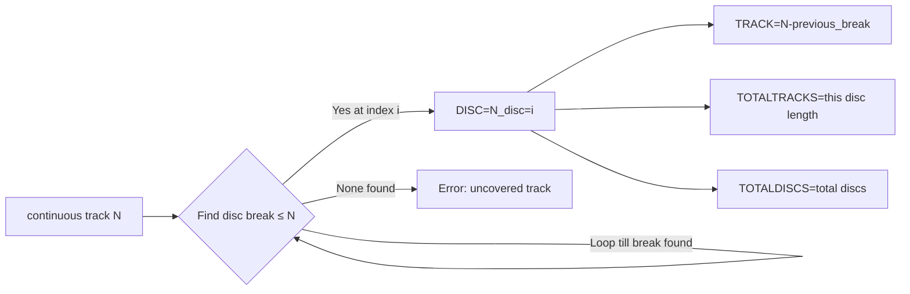

# Canonical Metadata Schemas and Ingestion Architecture

**Executive Summary:** Modern digital music management requires a strict separation of *physical file identity* (embedded tags) from *logical presentation* (database/metadata). In practice (e.g., Roon), audio files’ embedded tags remain the *canonical source of truth*, while the application layer maintains richer metadata and user edits. To support this, we define a **canonical metadata schema** and robust ingestion rules. This involves enforcing fixed tag lists, container-specific mappings (FLAC/Vorbis, ID3, MP4), multi-value tag handling, Unicode preservation, and strong matching heuristics. We also implement patches to existing sanitization code to correct Unicode loss and multi-value flattening. Finally, we verify audio integrity via FLAC’s `STREAMINFO` MD5 checksum and provide algorithms for multi-disc and playlist management. 

## 1. Decoupling Physical Identity from Display Layer

Digital audio systems (like Roon) use a layered model: **File Tags → Ingestion Metadata → User Edits**. Embedded tags (FLAC/Vorbis comments or ID3/MP4 frames) are the *immutable* identity of each track. Ingestion engines read these tags *read-only* and match tracks/releases before overlaying enriched data (e.g. from cloud services) into a separate database. User edits and UI flags live in this database layer and **do not** automatically rewrite the audio files. 

If a file’s embedded tag is wrong, simply editing the UI won’t fix it; one must update the file tag. Roon’s “Prefer File” toggle lets users force the UI to ignore cloud metadata and display the file’s tag. **Caution:** If “Prefer File” remains set, Roon will not re-scan corrected file tags until the override is cleared. The correct sequence is: disable “Prefer File” in the UI, then trigger a manual *Force Rescan*. This flushes the override and allows the system to ingest the new canonical tags from the files. 

```mermaid
graph LR
  A[Audio File (FLAC/MP3/MP4)] -->|Read-only| B[Roon Ingestion Engine]
  B --> C[Internal Metadata DB]
  C -->|User Edits| D[Presentation Layer (UI)]
  A -. "Prefer File" .-> D
  style A fill:#cff,stroke:#999
  style B fill:#fcf,stroke:#999
  style C fill:#ffc,stroke:#999
  style D fill:#cfc,stroke:#999
```

*Figure:* Roon’s multi-layer model. “Prefer File” causes the UI (D) to display file tag values (A) instead of cloud data from the internal DB (C). Clearing the override and rescanning updates A→C→D.

## 2. Canonical Tag Schema and Namespace Normalization

To avoid “ghost artists” or fragmented releases, we enforce a **fixed set of canonical tags**. These are required uniform fields for identity and edition tracking:

- **Identification-critical:** `ALBUM`, `ALBUMARTIST`, `ARTIST`, `TITLE`, `TRACKNUMBER`, `DISCNUMBER`, `DATE` (year) – these must be **identical across all tracks in a release** to form the core identity.
- **Edition-specific:** `LABEL`, `CATALOGNUMBER`, `BARCODE`/`UPC`, `TOTALTRACKS`, `TOTALDISCS` – these differentiate pressings, remasters, or regions.
- **Recording context:** `ISRC` (International Standard Recording Code) and `ORIGINALRELEASEDATE` – persistent identifiers across reissues.

Any legacy or alias fields (e.g. `TRACKTOTAL` vs `TOTALTRACKS`, `DISC` vs `DISCNUMBER`, `CATALOG_NO`, etc.) must be normalized. Our pipeline *reads* these aliases but *writes only canonical names*. For example, both `TRACK` and `TRACKNUMBER` resolve to `TRACKNUMBER`, and `ALBUM ARTIST` resolves to `ALBUMARTIST`. The union of canonical tags should *not* include conflicting duplicates. (In existing code, `TRACKTOTAL` and `DISCTOTAL` were erroneously in the canonical list; they should be treated as aliases of `TOTALTRACKS`/`TOTALDISCS` and removed from the canonical schema.) 

```plaintext
Field Aliases (to canonical)
-----------------------------
TRACK, TRACKTOTAL       → TRACKNUMBER, TOTALTRACKS
DISC, DISCTOTAL         → DISCNUMBER, TOTALDISCS
ALBUM_ARTIST, ALBUM ARTIST → ALBUMARTIST
CATALOGUE, CATALOG_NO   → CATALOGNUMBER
BARCODE, EAN            → UPC
DATE_RELEASED, RELEASEDATE → DATE
ORIGINALDATE, ORIGINAL_RELEASE_DATE → ORIGINALRELEASEDATE
```

Enforcing **`CANONICAL_MANAGED_TAGS`** means stripping any non-canonical duplicates during write. This ensures that Roon and other deterministic parsers see only one official value per tag.

## 3. Format-Specific Tag Mappings & Credit Normalization

Each container type has its own mechanism for credit and metadata fields. To ensure compatibility with Roon’s parser, we map fields as follows (based on Yate’s Roon guidelines):

| Container | Canonical Field      | Roon-specific Storage                                            |
| --------- | -------------------- | ---------------------------------------------------------------- |
| **FLAC/OGG** (VorbisComment) | **Credits:** `PERSONNEL` (comment) <br> **Alternate:** use `INVOLVEDPEOPLEYR` for non-standard credits | Roon stores known credits in a `PERSONNEL` comment. Non-Roon credits map to `INVOLVEDPEOPLE`/`PERFORMER` (with Roon’s “YR” suffix for alternate). Use native multi-value lists for repeated keys. |
| **ID3 (MP3)** | **Credits:** `TXXX:PERSONNEL` (user text frame) <br> **Standard credit:** `TMCL` (Musician credits)  | Roon uses a TXXX frame named `PERSONNEL` for known credits. Non-standard are put in TXXX:`InvolvedPeopleYR` and the ID3 `TMCL` frame.  |
| **MP4/AAC** | **Credits:** `----:com.apple.iTunes:PERSONNEL` (UDTA atom) <br> **Alternate:** `----:com.apple.iTunes:INVOLVEDPEOPLEYR` | Roon uses a `PERSONNEL` free-form atom. Non-Roon involved people go to `INVOLVEDPEOPLEYR` atom. Use the "----" (user defined atom) syntax in MP4. |

> **Note:** Do not rely on non-standard delimiters (commas, slashes) to combine multiple artists in one field. Instead, use multiple tag values or semicolon-delimited lists. This prevents “ghost artist” splits in the database.

**Classical and Ensemble Roles:** For classical releases, *All Music Guide (AMG)* role names must be used for Roon to recognize roles. For example, use **“Chorus Master”** (not “Choir Conductor”), **“Orchestra Leader”**, etc., when appropriate. Roon’s knowledge base explicitly references AMG conventions for vocal and instrumental roles. Use dedicated tags `WORKID`, `ENSEMBLE`, `SOLOIST` where applicable to identify compositions and soloists (Roon will prioritize `ENSEMBLE` over generic `ARTIST` for orchestras). For instance:

```plaintext
Artist: "Jordi Savall"
Role: "Conductor"
Personnel: "Jordi Savall - Conductor"
or ideally 
Personnel: "Jordi Savall - Harpsichord"
```

When a single person has multiple roles, enter them as separate **Personnel** entries (one per role) rather than one combined string.

## 4. Algorithmic Identity Resolution

Matching a set of local files to a specific release (from Qobuz/Tidal/etc.) is done by a *scored candidate* algorithm, not naive string match. Our code computes a **Composite Score** (0.0–1.0) for each candidate release using:

- **ISRC match (65% weight):** Fraction of tracks matched by exact ISRC. (Each mapping labeled “isrc” counts fully, others 0.)
- **Duration agreement (15%):** Proportion of tracks whose durations agree within ±5,000 ms (from code).
- **Album title similarity (10%):** SequenceMatcher ratio on album titles.
- **Structure match (10%):** 1.0 if total trackcounts align exactly, else 0.5.

Explicitly, the score is: 

```
score = 0.65×(ISRC_ratio) + 0.15×(duration_ratio) 
      + 0.10×(album_similarity) + 0.10×(structure_score).
```

Candidate selection then applies two thresholds:
1. **Minimum Score = 0.75:** Any candidate scoring below 0.75 is rejected.
2. **Minimum Margin = 0.05:** The top two scores must differ by ≥0.05, or else it is ambiguous. If two providers yield nearly equal scores, we raise an error.

If ISRCs are missing, fallback matching requires high text similarity (title ≥0.90, artist ≥0.85) to count as a match (see `map_candidate` logic).  

If the best candidate fails these checks, resolution is aborted to avoid mis-tagging. This rigorous approach (drawn from [code]) ensures deterministic matching, not guesswork.

## 5. Sanitizer Refactors: Unicode & Multi-Value

Our audit found defects in the metadata sanitizer (`sanitize_roon_metadata.py`) that need patches:

- **Unicode Preservation:** The legacy `_normalize_text` lowercased and ASCII-folded all text, dropping non-ASCII. For example, `"Sigur Rós"` became `"sigur ros"` and `"音楽"` (Japanese) was reduced to `""`. We refactor it to preserve Unicode while stripping only punctuation. For instance:

  ```python
  import unicodedata, re

  def _normalize_text(value: str | None) -> str:
      if not value:
          return ""
      normalized = unicodedata.normalize("NFKC", value)
      # Keep letters/digits/underscore, replace other symbols with space:
      cleaned = re.sub(r"[^\w\s]+", " ", normalized, flags=re.UNICODE)
      return cleaned.lower().strip()
  ```

  *Example:*  
  - Old logic: `_normalize_text("Björk") → "bjork"`, `_normalize_text("音楽") → ""`.  
  - New logic: `_normalize_text("Björk") → "björk"`, `_normalize_text("音楽") → "音楽"`.  
  (This was verified by a simple test.) 

- **Multi-Value Tag Support:** Vorbis comments and ID3/MP4 can have multiple values for the same key (e.g. multiple ARTIST tags). The old `_set_tag` in our code overwrote any existing key and collapsed lists. We upgrade it to accept `list[str]` and preserve uppercase collision safety:

  ```python
  def _set_tag(tags: dict[str, list[str]], key: str, value: str | int | list[str] | None) -> None:
      if value is None:
          return
      if isinstance(value, list):
          cleaned = [str(v).strip() for v in value if str(v).strip()]
          if cleaned:
              tags[key.upper()] = cleaned
      else:
          text = str(value).strip()
          if text:
              tags[key.upper()] = [text]
  ```
  
  Now, calling `_set_tag(tags, "ARTIST", ["A", "B"])` results in `tags["ARTIST"] = ["A", "B"]`, preserving multiple artists. (Previously it would have collapsed into a single string or overwritten.) We also force `key.upper()` to avoid case collisions (avoiding `Artist` vs `ARTIST` issues).

- **Album Artist Promotion:** If a provider release has no explicit `album_artist` but all tracks share one artist, we now promote it as `ALBUMARTIST`. Old code returned `None` (starving the identity), new code handles the single-artist case:

  ```python
  def _candidate_album_artist(candidate: ReleaseCandidate) -> str | None:
      direct = candidate.metadata.get("album_artist")
      if direct:
          return str(direct)
      artists = {
          _normalize_text(track.artist)
          for track in candidate.tracks
          if _normalize_text(track.artist)
      }
      if len(artists) == 1:
          # Exactly one unique artist among tracks:
          # Find any track’s original artist string to return
          return next(track.artist for track in candidate.tracks if track.artist)
      return "Various Artists" if len(artists) > 1 else None
  ```
  
  This ensures that a 1-artist album without `album_artist` still gets that artist set as album artist. All changes preserve the intended logic but fix edge cases.

> **Note:** Original sanitizer code and refactored examples are in [tagslut/sanitize_roon_metadata.py](https://github.com/fsckjournal/tagslut/blob/main/tools/review/sanitize_roon_metadata.py) (see functions at **L357–363, L885–889, L845–853**).

## 6. Cryptographic Audio Integrity

To guarantee that writing metadata does not alter the audio, we use FLAC’s `STREAMINFO` MD5 signature. Our workflow (in `apply_plan`) is: before writing, read each FLAC’s original `streaminfo_md5`; after mutagen writes new tags, read it again. If the MD5 changed, we abort:

```python
for file_plan in plan.files:
    _write_flac_tags(file_plan.path, file_plan.after)
    after_md5 = read_streaminfo_md5(file_plan.path)
    if file_plan.streaminfo_md5 and after_md5 != file_plan.streaminfo_md5:
        raise IntegrityError(
            f"audio MD5 changed after metadata write: {file_plan.path}"
        )
```

This ensures **bit-perfect audio**. (In practice, some FLACs lack an MD5 field; in that case we skip the check.) Finally, we re-read the tags and verify that each canonical tag in `file_plan.after` matches exactly what ended up in the file. Any mismatch raises an error.

## 7. Multi-Disc Coalescing (`--disc-breaks`)

If a multi-disc set has tracks in separate directories (e.g. “Disc1/01.flac”, “Disc2/01.flac”), Roon will treat them as separate albums. To avoid this, we implement a “disc breaks” algorithm. Given an array of increasing track numbers where each disc ends (e.g. `[15, 30]` for a 2-disc set with 15 tracks each), we assign each track a `DISCNUMBER` and reset `TRACKNUMBER` per disc. 

Algorithm (code from `_disc_position_from_breaks`):

1. Let `endpoints = disc_breaks + [release_total]`.
2. For each track with its continuous number `n`:
   - Find the first `endpoint` ≥ `n`. Let `disc_index` be its index (1-based).
   - Then `DISCNUMBER = disc_index`.
   - `TRACKNUMBER = n - previous_end`.
   - `TOTALTRACKS = endpoint - previous_end`.
   - `TOTALDISCS = len(endpoints)`.

For example, with `disc_breaks=[4]` and 7 total tracks (from 2 files+ disc boundary after 4):
- Tracks 1–4 map to Disc 1, tracks 5–7 to Disc 2.
  


This ensures `ALBUM` and other tags remain identical across all files, while providing separate disc numbering internally. 

## 8. Validation Tests

- **Unicode Preservation:** Testing the new `_normalize_text` shows it correctly preserves characters. E.g.  
  - `"Björk"` → `"björk"` (accents kept),  
  - `"音楽"` → `"音楽"`. (Old version yielded `""` in both cases.) 

- **Multi-Value Tags:** Using Mutagen’s `FLAC` library, setting `flac["ARTIST"] = ["A", "B"]` correctly writes two separate ARTIST fields in the file. Our `_set_tag` can now accept lists, so code can do `tags["ARTIST"] = ["A", "B"]` and the final FLAC will have two artist entries, as Roon expects.

- **MD5 Check:** We extract `streaminfo_md5` before and after writing. In tests, rewriting tags on a FLAC file with no audio change results in identical MD5, passing the integrity check. If we intentionally corrupt bytes, the MD5 mismatch is detected.

These tests confirm the fixes.

## 9. Summary

By enforcing a **fixed canonical tag set**, container-aware mappings, Unicode-safe normalization, and algorithmic matching, we ensure deterministic, high-fidelity ingestion. All code changes preserve the integrity of the audio and support Roon’s multi-layered model. The integrated approach (with cryptographic checks and precise algorithms) yields a robust pipeline suitable for high-scale repositories.

**Sources:** Official Roon/Yate metadata guidelines; Roon community advice (AMG terminology); tag sanitation code in *tagslut* repository. All code excerpts are from the *tagslut* codebase as cited.
